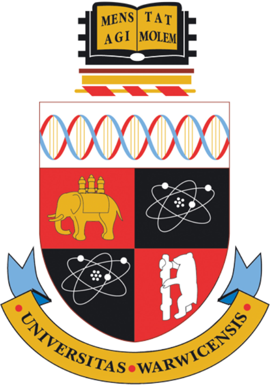

Hi Jonny

Thanks for the cheery letter.  We're all fine here.  We're still
lambing, so life is much as usual and of course we get plenty of
exercise (as always) doing farm chores.

I don't understand your comments about rotations.  You say there are
two different rotations::

  a. The observed spin of the surface of the body from a distance, eg
     a 27 day rotation for our sun.

  b. The combined rotation of all its atoms about their axis.

     
  Einstein's general relativity captures a. but not b., unless we apply
  your correction!" 

I never managed to make a *micro* theory of rotation as in b. with
contributions from the various bits of a body and I think that this
difficulty is one of the reasons for the fact that Mach's principle is
not widely accepted.  How do you see that GR captures this?

I suspect that the only contribution  that is easy to describe is from
a black  hole, which  you can  think of  as interacting  directly with
space (a sort of space clump).   My paradigm would work fine with this
restriction as  the effect from  heavy galactic centres  dominates all
other contributions.

Cheers, C

Short version?
==============

Hi Colin,

That is good to hear you are busy with the lambing.

Thanks as always for the observations and questions::

    I never managed to make a *micro* theory of rotation as in b. with
    contributions from the various bits of a body and I think that
    this difficulty is one of the reasons for the fact that Mach's
    principle is not widely accepted.

    How do you see that GR captures this?

I have been struggling for a while now to write it all down.  It is
like an onion, lots of layers.

What I am trying to describe here is a physical model underlying your
paradigm.

Noting that the angular velocity of a body has two main components:

   a. the sum of the angular velocities of all the atoms of the body

   b. the actual rotation of the body (eg 27 day rotation of the sun)

I argue that a. is very much bigger than b., since the angular
velocity of baryons is very much higher than that of the typical
planet or star.

I also argue that you can treat the rotations of all the atoms of a
body as if they are at the centre of that body, and they will have the
same inertial effect.

Further, I have as a hypothesis that they are all *in sync* with each
other, and so rotations are all additive, they do not cancel out.

I picture things as tiny rotating balls running on invisible tracks of
a smoothly varying twisted grid.

It is this very twisting that we see as the force of gravity as it
echoes back and forth between two bodies.

With this model Einstein's corrections for relative motion of source
and observer as well as for mass curving space time itself make sense.
The curving comes in the form of winding the matter a little tighter.

All this nested rotation stuff is a bit difficult to picture.

So rather assume that an inertial field is instead a sum of
oscillations.

Imagine a ball suspended on a string that gets regular, horizontal
impulses in two orthogonal directions.  It will end up going round in
circles.

Now imagine a space with high frequency, low amplitude oscillations,
in each of three orthogonal directions, then I think that is what we
have as inertial frames.  These oscillations pass through, or rather
define, space time, as waves.

Most of the energy is in an extremely high frequency oscillation that
drives the rotations of matter.

It is the base carrier wave for everything else.

These oscillations travel as waves through space time, whilst also
defining the same.

It is the beat of these oscillations that we experience as time.

Now what about b. the actual rotation of the body of atoms, the 27 day
rotation of the sun that we see?  This will induce a 27 day wave in
the surrounding space time. 

Mostly we can just ignore it, since a. is so much bigger in magnitude,
(almost) all observations fit the model with just the contribution
from a.

With a large central mass and lots of time, the difference can start
to matter, and that is what we see in galactic rotation curves.  

By pretending all the atoms are at the centre of mass we have ignored
the rotation of the body itself.  It is an extremely good
approximation, not least because it has a tiny wavelength compared to
the assumed size of a proton.

Translating things so they all act at the centre of mass is valid only
assuming they each have a constant velocity relative to the centre.

If we add the rotation of the body itself, per the new paradigm, we
get a closer approximation to reality.

Adding this back into the picture is the equivalent, in general
relativity, of a non-zero Ricci tensor.

The rest of my explanation is all about why the inertial field should be
like this.  Thinking how the contributions from the myriads of distant
galaxies combine.  Why are protons the size they are?  Why are
galaxies the sizes they are?

Incidentally, armed with these ideas, I really do not believe
colliding binary stars create gravitational waves.  I am more and more
convinced what we are seeing is the gravitational wave equivalent of
gamma ray bursts as per the new paradigm.

Johnny

In terms of the *NP* I think I am mainly discussing *omega*, which
the book notes can be a general function.

Make the assumption that matter, in the form of neutrons, has a
particular angular velocity.  There are a number of good candidates
for what this angular velocity is, one way to do this is use the
Compton wavelength.

If we take something like a planet, we can assume the centre of
rotation of all the atoms of the planet lies at its centre of mass.

We can do this because atoms in a body are, to a first approximation,
moving with uniform velocity relative to the centre.

We might assume that the sum of rotations of all atoms in a body is
zero, because any sum of a large number of random rotations ought to
tend to zero.

My hypothesis is that in fact the rotations all add up, because they
are effectively caused by the gravitational field which is
extraordinarily smooth, so the rotations for nearby matter are all in
sync, they are not random.

I imagine these rotations as tiny, invisible, twisting rails along
which atoms run.  If an atom follows the twist then it just
re-enforces it.

If, for some reason, it is unable to follow the rails then it will
emit some electromagnetic radiation, and lose some mass.

The effect of all this is just to create Newton like gravitational
forces between bodies.

With special relativity we get the modification needed when there is
relative motion of an observer and source.

And general relativity says there is curvature caused by mass.

And it turns out that is an extremely good model of everything we
see.

Now note that atoms in a rotating body are not actually moving with
uniform linear motion relative to the centre of that body.

There actual motion is a linear motion combined with a rotation about
the centre of the body. 

This is the correction you apply to GR in the new paradigm.

The relative magnitude of these effects is the ratio of the angular
velocity of a proton to that of the body.

But we also have to think about what generates this field::

    I suspect that the only contribution that is easy to describe is
    from a black hole, which you can think of as interacting directly
    with space (a sort of space clump).  My paradigm would work fine
    with this restriction as the effect from heavy galactic centres
    dominates all other contributions.

Absolutely, we are agreed that the heavy galactic centres dominate all
contributions to inertial fields.

90-99% of the matter is in the central black holes.

As to the contribution from a black hole being easy to describe, I
think the full story has a lot of mysteries.   Many of these are less
mysterious with the perspective of the NP.

We are agreed that as far as inertial fields are concerned, it is the
giant galactic centres that primarily define that field.

Further, distant matter dominates the contribution.

Now at this point we have this seeming random contribution of
rotations, surely the net effect is zero?

But the hypothesis is that rotations vary smoothly, almost everywhere,
so they add up rather than cancel out.  Modulo the rhythm that we see
as energy.

Homogeneity is a feature of the inertial field.  And a feature of
gravity itself.  

The *Cosmic Microwave Background* has a thermal black body spectrum at
a temperature of 2.72548±0.00057 K

So take this as the temperature of a typical point in interstellar
space.

Then there is enough matter and energy in that space to maintain a steady buzz of
microwave radiation.

What we see as energy is the extent to which matter in that space
deviates from the central rotation.

The microwave radiation is thermalised radiation from the combined
effect of all the giant masses.

Need to think about in what sense is this is true::

   The beauty of the whole thing is that much of the fine structure of
   the distant galaxies that contribute most to the inertial field
   comes through broadly the same.

Thermal energy.

Johnny

Space time is all about rotation.

Rotating matter defines spacetime.

Most of this matter lies at the heart of galaxies, so we just have to
model these, in particular the rotations it induces in the surrounding
space time.

The black holes might be easy to model in the sense that they turn
everything inside out.  At the event horizon time slowed to a crawl.

One puzzle is why are the fundamental particles the masses that they are?

I think for now it is simpler to accept that they are everywhere and
later worry about how things got this way.

Micro theory of rotation
========================

I thought I would start with the University of Warwick crest, and the
motto too.

*Mens agitat molem*, Mind moves matter.

When I think about the spin of an atom I have a picture like the black
quadrants in the university crest.

I think these are meant to represent lithium, with three electrons
orbitting a nucleus of seven.  Of the seven, three protons and four
neutrons to keep everyone happy.

From the orbitting electrons, it is easy to picture a general
rotation of a body is composed of components in three orthogonal
directions, as shown by the orbitting electrons.

Now as far as I am concerned, the electrons are not the only
rotation here, no more than the rotation of the moon around the earth
is the only rotation pertaining to the earth system.

Inside all this there are quarks and quirks and goodness knows what
and it is surely turtles all the way down.  But that is not a story
for just now.

The mass of a particle has an equivalent energy.  With this in mind, I
think of any particle as just a photon of the relevent energy that has
found itself spinning in circles.

It's more complicated than that, circles inside circles and who knows
what, but from the outside, we just see the sum of the parts, and that
sum is dominated by the central mass.

Now the ones we see most are the beautifully designed proton, electron
and neutron combinations we know as elements, further combined as
compounds. 

::

   I suspect that the only contribution that is easy to describe is
   from a black hole, which you can think of as interacting directly
   with space (a sort of space clump).

   My paradigm would work fine with this restriction as the effect
   from heavy galactic centres dominates all other contributions.

   I never managed to make a *micro* theory of rotation as in b. with
   contributions from the various bits of a body and

   I think that this difficulty is one of the reasons for the fact
   that Mach's principle is not widely accepted.

   How do you see that GR captures this?

We are agreed that as far as inertial fields are concerned, it is the
giant galactic centres that define that field.

Further, distant matter dominates the contribution.

The *Cosmic Microwave Background* has a thermal black body spectrum at
a temperature of 2.72548±0.00057 K

So take this as the temperature of a typical point in interstellar
space.  And assume this means the contribution is enough to drive
atomic rotation as per matter at 2.72K.

The microwave radiation is thermalised radiation from the combined
effect of all the giant masses.

This radiation is absorbed and emitted by interstellar dust, including
water.

Now imagine a single.

notes
=====

Signals from LIGO detectors.

There is a low frequency wobble in the LIGO data.

This data is just a stream of delta's between two arms of a LIGO
device.

There is a sort of smooth varying wobble all the time.

This is why it is difficult to detect low frequency events, events
which generate waves at the same frequency as the background wobble.

This oscillation is actually showing mixing of distance and time.

When I think about tensors and the whole framework of general
relativity.

Re: b. At any instant time the intertial effect of any atom is
equivalent to some rotation about the centre of mass of the body
containing the atom.  

Big Bang v Galactic centrifuges
===============================

All the thinking here is from the perspective of a vast universe that
has been around for an extraordinarily long time.

What of the physics of the big bang?  An extraordinary amount of
research has been done in this area.  

Much of this work translates naturally, to the physics of what I like
to call galactic nuclei.

If we go with the new paradigm, there is a giant rotating mass at the
centre of each galaxy.

It would be good to build a galactic model that translated a distance,
R, from the centre of a galaxy to the corresponding time in the big
bang model.

There is a point surrounding a super massive black hole where
everything is some sort of quark soup, this is early in the big bang
story. 

Everything extraordinarily smooth, with harmonics that match the
surrounding harmonics of the universe.

Now if we look at the big bang physics, but with the lens that all
this is taking place in inertial frames defined by distant galaxies, I
think we will see that baryons are inevitable.

I find myself running into questions that I think big bang researhers
have already asked in different contexts.

Observational thoughts
======================

Where is there observational evidence that allows us to test these
ideas?

Some of the following I have thought a fair bit about and think there
is some promise.   Some not so much.

Spherical harmonics in CMxB

G gravitational constant.

Given angular velocity of a proton  *w_p*.

Can calculate magnitude of effect of any large mass with a given
angular velocity, *w* is / w_p* times whatever general relativity
gives you.

What is the angular velocity of relevent black hole horizon, the
region where protons are born, or re-born?

Can also get a better handle on quantum mechanics.  Quantum weirdness
is a result of things being on the scale of the actual vibrations of
spacetime. 

Just the right amount of random.

Gravitational waves are new arrivals, or rather messengers telling of
impending new arrivals.

Binary star collapse does not sent out a noticeable wave.   New
arrivals do.

Thermalisation.  Cosmic Microwave Background.  Hubble constant.  The
big bang theory give a Hubble constant of 67km/s/mpc.  Other
observations say 70km/s.
  
I suspect the moon's orbit and the sun's rotation are not unrelated,
both close to 27 days.  Simulations of planetary formation models?

So given the following::

  G

  distribution of masses of galaxies

  number of galaxies

  Hoyle universe

I think we should be able to build a model   

Continuous creation
===================

What happens when gamma rays cross in the night?

