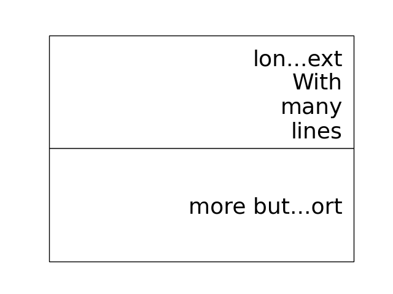

==================
 Where are we at?
==================

What's happening with the `blume.table.Table`?

2020/12/03
==========

I started work on a `blume.taybell.table` function, with the same
interface as the current `blume.table`, but some additonal tricks.

The goal is to come up with a way to specify the maximum string-length
to display, with ellipses used if the string is too long.

I have been using `blume.examples.shortify` to test the code.  Still
buggy, but I love that brief moment of joy when the code runs and the
output, whilst not what intended, is better than expected:

.. image:: images/short.png

Fixed the bug, ruined the image:

Fixme?

Look for white space to delete?

Camelcase while we are at it?           
           

Interactive Magic
-----------------

it has mainly been a period of small improvements to the
`blume.examples.ocixx` module.

This module downloads and plots data from the Ottawa Covid Database,
also known as *the COD*.  This is a database of Covid 19 cases in the
Ottawa area.

See comments in the *ocixx* code for more information on the data
sources.

There are a handful of tables available and they are generally updated
once a day.

The code now downloads new data, compares to see if it has changed,
commits to git if so.

It then spins through all the commits and plots each version of each
variable in the file.

It is also using a *magic spell* to cast data and attempt to fill in
missing values.

Cosmology
---------

There has been a lot of news from on gravitational waves with a number
of announcements relating to observations in the third observational
run.   See `waves.rst` for more information from the key papers.  

I read something this week that the black hole at the centre of our
galaxy is deemed to be 2000 or so light years nearer to us than had
previously been thought, based on observations from the Gaia project.

I am wondering if this will in time put strain on the idea that Sag A*
is indeed at the centre of our galaxy.

2020/09/02
==========

September.   `guide.rst` for a longer version.

2020/07/28
==========

So what's happening with this table thing?

The project has evolved into an exploration of all things table.

It turns out everyone has a table, so the project is looking for
common themes.

How to build tools that make it easy to explore tables of data?

For now there are a few examples here.

Once you have `blume` installed you can run most modules from the
command line::

  python3 -m blume.mb -h

The `-h` option gives you help, showing options for the module

Most modules are using the `blume.magic` to display `matplotlib`
hplots.

The magic is allowing everything to run asynchronously.  It is partly
an opportunity for me to explore asynchronous programming.

Recent work has been on the `blume.gaia`, `blume.gw` and `blume.mb`
modules.

Gaia is a module to download and display data from the Gaia mission
surveying our galaxy.

The *gw* module plots gravitational waves for random sized black hole
mergers.

*mb* is the obligatory random Mandelbrot generator.

In other news, I just discovered the *einsteinpy* project.  This looks
like it will be a great help as I continue to explore *U is for
universe*.  See https://docs.einsteinpy.org for more on Einstein.

2020/03/16
==========

With ski hills closing throughout the land I find myself back in
*blume* land, sooner than expected.

It looks like I may be back here for a while.

As I expected not much has happened here in the last couple of months.

During that time there has been a steady stream of articles about
interesting discoveries across the universe.

Black holes colliding, the size of a neutron star, a blazar likely a
billion solar masses some 12-13 billion light years away?

Often, each new observation creates new puzzles.

Now I am back I plan to focus on the U for universal for a while.

My immediate goal is to try to explain the work of Colin Rourke, and
his book, "A new paradigm for the universe".

It is a wonderful book that links topics from gamma ray bursts to
black holes, the centre of our galaxy, the cosmic microwave background
and Einstein's general theory of relativity.

It suggests that both dark matter and the big bang theory are critical
mistakes in our understanding of our universe and is able to explain
galactic rotation curves without the need for dark matter.

2020/02/03
==========

It is winter in the frozen north.

That means spending a lot of time teaching people to ski and not
so much on other projects, *blume* included.

There has still been time to think more about *tables*, in their
various disguises. 

The meaning, if any, of the letters of *blume* is evolving.   What
follows is an update, letter by letter.

Better or Basic
---------------

A simple interface to view images (*matplotlib plots*) produced by
objects connected together by a graph of asychronous queues.

View the queues.

Switch things on and off.

Once this is working, explore the universe and our planet.

Little
------

The aim is to keep the code here to a minimum.   A few thousand lines.

I have tried to focus on tables as *lists of dictionaries* or
*dictionaries of lists*.

But then there are the special *keys*: time stamps, locations,
latitudes and longitudes.

Right ascension, declination too.

Relative velocities and central masses.

Grids.  Tables as grids and grids of global data.

`healpix` data, as used by the *LIGO* project to give heavenly maps of
probable source of *waves in space time*.

Did someone mention *little*?

Universal
---------

Something that is, or appears to be everywhere.

I am on a bit of a cosmological diversion thanks to the wonderful work
of Colin P. Rourke.  In particular, his book, *A new paradigm for
the universe* [1]

His book has some *mathematica* code that allows you to simulate
galactic rotation curves, using the mathematics of the book.

The `blume.cpr` module is an attempt to re-implement that code in
python.

At this point I am just missing a `table` of some sort from Colin's
*Mathematica* code, but I think I can get by with *lists of
dictionaries*, or is it *dictionaries of lists*?

So a tenuous link with the `blume.table`.

Matplotlib
----------

So tables of data and `blume.table` just one way to display it with `matplotlib`?

This is rather different to the `blume.table`, which currently is only
concerned with displaying a grid of values.

Engines
-------

This list is evolving.  The aim is if you are just here for the
`blume.table` that should work without additional dependencies.

The cost here is modules that require the packages below.  I think of
them as engines, as in most cases they provide a whole eco-system of
tools. 

Since we have `matplotlib` we also have `numpy` and `python-dateutil`
too. 

curio
'''''

For everything *async* and *await*.

healpy
''''''

This is a magical format for storing *spherical data*.

A list of pixel values, with each *pixel* covering an equal area of
some sphere.

It includes `healpy.sphnfunc`, a collection of tools to do spherical
harmonic analysis of data, for which the format itself is ideal.

Other data sources tend to give a grid of latitudes and longitudes,
which gives higher resolution at the poles.

It has a nested data format that is efficient for
changing resolution.

It uses `matplotlib` to do plotting too, so it is good to have around
on this adventure.

Pandas
''''''

For another take on *table* there is `pandas.DataFrame`.

`pandas` itself is a whole ecosystem, with time-series plotting and
more and once more, `python-dateutil`.

Whichever way *blume* goes, I expect it will have a
`to_pandas_data_frame` somewhere.

I like *pandas* very much.  Like *healpy* it uses *matplotlib* to help
with plotting.

astropy
-------

Tracking the solar system.  It's own system of units too.

And low and behold, an `astropy.table`.

`astroquery` too.

Road and rail blocks
====================

As I write code I go through periods of feeling blocked.  I am not
happy with some aspect of the code, but I need to change something,
but that is likely going to make things worse unless I can figure out
what the real problem is.

And where the solution belongs.

Assigning events to keyboard actions
------------------------------------

I have spent a disproportionate amound of time thinking about this
part of the user interface side of things.

I am focussing on keyboards and wanting to keep things simple, so the code
generally just maps a key to a co-routine.

Does not feel like it should be part of this code at all, the code
just needs to advertise what co-routines are available for interactive
use and let some other tool deal with what events trigger what?

Maybe the code just hints which co-routines are more likely to be
called?   Or provides a word to describe it?

But anything that is used regularly will likely need to be predictable.

I am wondering if this can be done in a way that isn't annoying:  you
have to re-teach the computer every time you play?

Without persisting any information from one process to the next?

How to let the user navigate their way?

Magic roundabouts?

Directed graphs of co-routines sharing data with queues.

[1]  http://msp.warwick.ac.uk/~cpr/paradigm/
