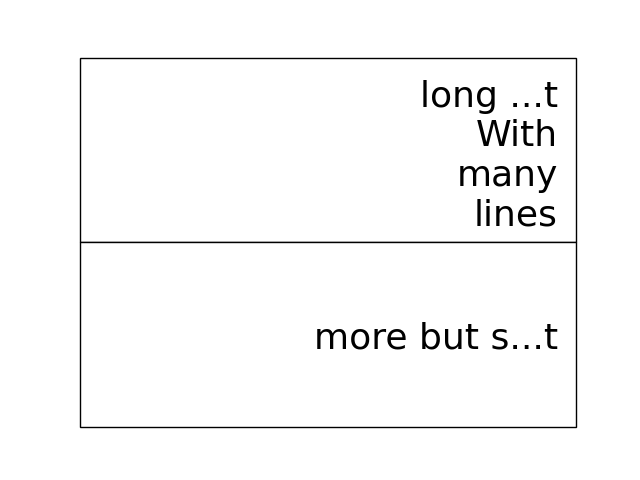

.. _news:

==================
 Where are we at?
==================

What's happening with the `blume.table.Table`?

My adventures in *matplotlib* land continue.

2022/4/2
========

I have now transferred the previous core to use the standard
matplotlib figure manager to display everythng.

It comes with my attempts at an interface.

Think of it like an adventure game.

Pressh *h* for help and check the console for what key does what.

Typically examples have a number of *magic.Ball* objects added to the
farm.

The *Balls* have a run coroutine that typically waits for an
*matplotlib* Axis object.

To make everything work, these Axes are wrapped in a *blume.farm.Axe*,
which allows all sorts of hacks, such as setting setting the Axes
location to that of some other Axis to allow us to move things around
as we generate new *mosaics*.

Things are very much at the *throwing Axe's around and seeing what
happens* stage, but everything is working well enough that I can get
back to some examples where I am exploring data.

There's also a plan to allow Ball's to set the mosaic and have Axe's
turn up with meta data based on the mosaic, so a Ball could consult
the meta data and decide accordingly what it should do with the Axe.

Between the hacks and the asynchronous nature there are lots of rough
edges, which in turn throw up some interesting images.

If you press *n* it will take you to the next object in the farm.
Check the console to see what it is.

To start it running, press *R*, but before you do that you might want
to press *i* which allows you to browse and change the attributes of
the objects.

It is sort of like a debugger if you like.

I want to be able to edit *matplotlib.rcparms*.   I am still hoping
the validators in rcsetup will prove useful here.

I see ValidateInStrings has a *valid* attribute with the set of valid
strings.  Now I just need to find a way to make it all rotate.

But what about the table?  
-------------------------

Between Legends, Axes labels, plot titles, mosaics of axes, plot lines
and images, there are a lot of dimensions to use to explore data.

For now, my tour of matplotlib 

2021/10/21
==========

tldr: matplotlib already has a solution to everything.

For the last few weeks I have been working on trying to simplify the
`blume.magic` module.

I use the word *magic*, not because it is, but it contains parts of
the code put together with just enough to boot-strap some sort of
interface that I can start to experiment with.

The idea was to have a bunch of objects, not knowing too much about
each other, passing messages between each, other, asynchronously.

Using matplotlib to create images.

I have decided to take the plunge and switch things around a little.
In particular, to just use the built in *FigureCanvas* from matplotlib
to display images.

At the same time I am experimenting with simply making `magic.Ball`,
inherit from `matplotlib.artist.Artist`.

This opens up a lot of existing `matplotlib` infrastructure.  One area
I plan to explore at some point is the *rc* setting infrastructure.

Meanwhile, the part I have been focussing is on is the passing of
messages between artists.

Up to now *blume* each object has only had two queues that the system
manages, *stdin* for incoming messages and *stdout* for outgoing.

This has all been achieved by `magic.RoundAbout` with a lot of help
from a `Shepherd` and friends.  There is some code that allows for
arbitrary named queues, but the `Shepherd` does not watch those.

My plan is to have a network of objects for each queue name.  Each
edge being a queue.  

I'm aiming to have a networks of objects for each class of messages.

You can see some of this in the *GeeFarm* and *Shepherd* which both
have graphs (from *networkx*, actually the same graph).

The Shepherd also has a *path* attribute, that is a list of *artists*
to which to send keyboard input to.  This is all managed by the magic
roundabout, in so far as that is where each object stores the
dictionary of keyboard events and corresponding functions or
coroutines to call when that event happens.

This gives me another reason to re-visit the *matplotlibrc* handling.
This is precisely where *matplotlib* stores bindings between keyboard
events and functions to call.

Separating this from the code could be a really good step.  I am sure
there are some more hidden gems that can be of use.

async
-----

The magic part of the project has been an exploration of using
python's relatively recent (3.6?), *async* features.

At the core,  is David Beazley's `curio`_.  In particular, the
`UniversalQueue`, which has some genuine magic that allows it to
bridge the *async* and normal worlds.

In other words, you can pass the same UniversalQueue to this function
and co-routine and they both successfully put 100 on the queue.

::
   def func(uq):
       return uq.put(100)
       
   async def coro(uq):

       return uq.put(100) 
     
The joys and trials of backends
-------------------------------

This may sound ironic, but one of the reasons I originally went with a
*Tk* backend is I wanted it to be easy to support other back ends.

The `blume.teakhat` module is a simple *Tk* window that just displays
images and passes keyboard events to a function of my choosing.

The idea was that at this level, `blume` just needs grids of numbers,
maybe with three or four layers, for red, green, blue and alpha.

Now, `ax.imshow` more than handles this for us.

The next layer, a `magic.Carpet` just lays images in square grids.
`blume.mosaic` has the beginnings of a new approach, using the
subplot_mosaic.

I'm also experimenting with constrained layout, which I am hoping to
co-opt at some point to layout tables.   Maybe even tables where every
cell is a set of axes.

And that it shouldn't be too hard to write something to do that given
another backend.

One *backend* I am thinking about is a pixel grid such as a sense hat
on a raspberry pi.  The Sense Hat, or `astro pi`_ also has a joystick
which can generate events to control everything.  This was another
reason I am trying to avoid specifying what events do what.

Which brings me back to magic roundabouts and event routing.

2021/09/01
==========

I have been on a bit of a tour of parts of matplotlib that are
concerned with laying out rectangles in grids.

It is a common problem, legends, tables, grids of plots and more
recently mosaics too.

Each approach has a different focus, and each has some features very
specific to the use case.

The `blume.legend` module is where I am trying to combine some of
these ideas.   Together with `blume.examples.legendary` where much of
the fun is.

For a while, the plan was just to use the objects from
`matplotlib.offsetbox`, also used by `matplotlib.legend`.

This takes a nice approach to scaling of text by having artists scale
the size of their drawings by the font size in points.   For example,
if you want to place padding around some text, make that padding a
multiple of the fontsize and all should be good.

The recent new arrival of `subplot_mosaic` introduces some powerful
ways to describe the subplots you wish to see.

It allows mosaics of axes to be created.  In addition, each cell of a
mosaic can be its own mosaic, and so on ad-infinitum, or at least to
some recursion limit.

So we can now have tables, where every cell of the table is, in fact,
an entire axis.

I think what I need at this point is some combination of the offsetbox
magic with the mosaics and it should be possible to make some very
interesting tables.

2020/12/03
==========

I started work on a `blume.taybell.table` function, with the same
interface as the current `blume.table`, but some additonal tricks.

The goal is to come up with a way to specify the maximum string-length
to display, with ellipses used if the string is too long.

I have been using `blume.examples.shortify` to test the code.  Still
buggy, but I love that brief moment of joy when the code runs and the
output, whilst not what intended, is better than expected:

Fixed the bug, ruined the image:

Fixme?

Look for white space to delete?

Camelcase while we are at it?           
           

Interactive Magic
-----------------

it has mainly been a period of small improvements to the
`blume.examples.ocixx` module.

This module downloads and plots data from the Ottawa Covid Database,
also known as *the COD*.  This is a database of Covid 19 cases in the
Ottawa area.

See comments in the *ocixx* code for more information on the data
sources.

There are a handful of tables available and they are generally updated
once a day.

The code now downloads new data, compares to see if it has changed,
commits to git if so.

It then spins through all the commits and plots each version of each
variable in the file.

It is also using a *magic spell* to cast data and attempt to fill in
missing values.

Cosmology
---------

There has been a lot of news from on gravitational waves with a number
of announcements relating to observations in the third observational
run.   See `waves.rst` for more information from the key papers.  

I read something this week that the black hole at the centre of our
galaxy is deemed to be 2000 or so light years nearer to us than had
previously been thought, based on observations from the Gaia project.

I am wondering if this will in time put strain on the idea that Sag A*
is indeed at the centre of our galaxy.

2020/09/02
==========

September.   `guide.rst` for a longer version.

2020/07/28
==========

So what's happening with this table thing?

The project has evolved into an exploration of all things table.

It turns out everyone has a table, so the project is looking for
common themes.

How to build tools that make it easy to explore tables of data?

For now there are a few examples here.

Once you have `blume` installed you can run most modules from the
command line::

  python3 -m blume.mb -h

The `-h` option gives you help, showing options for the module

Most modules are using the `blume.magic` to display `matplotlib`
hplots.

The magic is allowing everything to run asynchronously.  It is partly
an opportunity for me to explore asynchronous programming.

Recent work has been on the `blume.gaia`, `blume.gw` and `blume.mb`
modules.

Gaia is a module to download and display data from the Gaia mission
surveying our galaxy.

The *gw* module plots gravitational waves for random sized black hole
mergers.

*mb* is the obligatory random Mandelbrot generator.

In other news, I just discovered the *einsteinpy* project.  This looks
like it will be a great help as I continue to explore *U is for
universe*.  See https://docs.einsteinpy.org for more on Einstein.

2020/03/16
==========

With ski hills closing throughout the land I find myself back in
*blume* land, sooner than expected.

It looks like I may be back here for a while.

As I expected not much has happened here in the last couple of months.

During that time there has been a steady stream of articles about
interesting discoveries across the universe.

Black holes colliding, the size of a neutron star, a blazar likely a
billion solar masses some 12-13 billion light years away?

Often, each new observation creates new puzzles.

Now I am back I plan to focus on the U for universal for a while.

My immediate goal is to try to explain the work of Colin Rourke, and
his book, "A new paradigm for the universe".

It is a wonderful book that links topics from gamma ray bursts to
black holes, the centre of our galaxy, the cosmic microwave background
and Einstein's general theory of relativity.

It suggests that both dark matter and the big bang theory are critical
mistakes in our understanding of our universe and is able to explain
galactic rotation curves without the need for dark matter.

2020/02/03
==========

It is winter in the frozen north.

That means spending a lot of time teaching people to ski and not
so much on other projects, *blume* included.

There has still been time to think more about *tables*, in their
various disguises. 

The meaning, if any, of the letters of *blume* is evolving.   What
follows is an update, letter by letter.

Better or Basic
---------------

A simple interface to view images (*matplotlib plots*) produced by
objects connected together by a graph of asychronous queues.

View the queues.

Switch things on and off.

Once this is working, explore the universe and our planet.

Little
------

The aim is to keep the code here to a minimum.   A few thousand lines.

I have tried to focus on tables as *lists of dictionaries* or
*dictionaries of lists*.

But then there are the special *keys*: time stamps, locations,
latitudes and longitudes.

Right ascension, declination too.

Relative velocities and central masses.

Grids.  Tables as grids and grids of global data.

`healpix` data, as used by the *LIGO* project to give heavenly maps of
probable source of *waves in space time*.

Did someone mention *little*?

Universal
---------

Something that is, or appears to be everywhere.

I am on a bit of a cosmological diversion thanks to the wonderful work
of Colin P. Rourke.  In particular, his book, *A new paradigm for
the universe* [1]

His book has some *mathematica* code that allows you to simulate
galactic rotation curves, using the mathematics of the book.

The `blume.cpr` module is an attempt to re-implement that code in
python.

At this point I am just missing a `table` of some sort from Colin's
*Mathematica* code, but I think I can get by with *lists of
dictionaries*, or is it *dictionaries of lists*?

So a tenuous link with the `blume.table`.

Matplotlib
----------

So tables of data and `blume.table` just one way to display it with `matplotlib`?

This is rather different to the `blume.table`, which currently is only
concerned with displaying a grid of values.

Engines
-------

This list is evolving.  The aim is if you are just here for the
`blume.table` that should work without additional dependencies.

The cost here is modules that require the packages below.  I think of
them as engines, as in most cases they provide a whole eco-system of
tools. 

Since we have `matplotlib` we also have `numpy` and `python-dateutil`
too. 

curio
'''''

For everything *async* and *await*.

healpy
''''''

This is a magical format for storing *spherical data*.

A list of pixel values, with each *pixel* covering an equal area of
some sphere.

It includes `healpy.sphnfunc`, a collection of tools to do spherical
harmonic analysis of data, for which the format itself is ideal.

Other data sources tend to give a grid of latitudes and longitudes,
which gives higher resolution at the poles.

It has a nested data format that is efficient for
changing resolution.

It uses `matplotlib` to do plotting too, so it is good to have around
on this adventure.

Pandas
''''''

For another take on *table* there is `pandas.DataFrame`.

`pandas` itself is a whole ecosystem, with time-series plotting and
more and once more, `python-dateutil`.

Whichever way *blume* goes, I expect it will have a
`to_pandas_data_frame` somewhere.

I like *pandas* very much.  Like *healpy* it uses *matplotlib* to help
with plotting.

astropy
-------

Tracking the solar system.  It's own system of units too.

And low and behold, an `astropy.table`.

`astroquery` too.

Road and rail blocks
====================

As I write code I go through periods of feeling blocked.  I am not
happy with some aspect of the code, but I need to change something,
but that is likely going to make things worse unless I can figure out
what the real problem is.

And where the solution belongs.

Assigning events to keyboard actions
------------------------------------

I have spent a disproportionate amound of time thinking about this
part of the user interface side of things.

I am focussing on keyboards and wanting to keep things simple, so the code
generally just maps a key to a co-routine.

Does not feel like it should be part of this code at all, the code
just needs to advertise what co-routines are available for interactive
use and let some other tool deal with what events trigger what?

Maybe the code just hints which co-routines are more likely to be
called?   Or provides a word to describe it?

But anything that is used regularly will likely need to be predictable.

I am wondering if this can be done in a way that isn't annoying:  you
have to re-teach the computer every time you play?

Without persisting any information from one process to the next?

How to let the user navigate their way?

Magic roundabouts?

Directed graphs of co-routines sharing data with queues.

[1]  http://msp.warwick.ac.uk/~cpr/paradigm/
